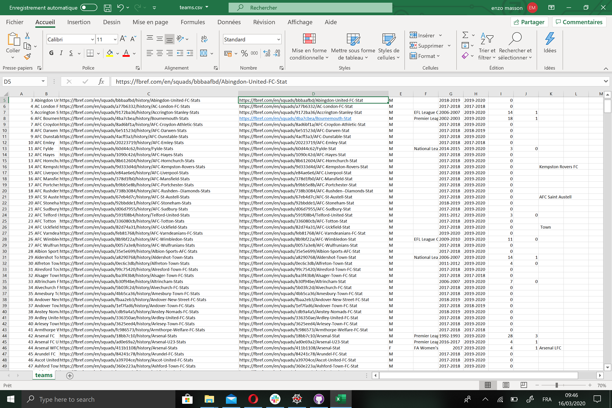

# football_data_science

The aim of this project is to create a dataset of the english's football clubs. In this dataset you will find several clubs, sorted by division and then by name. 

To do this work, we used this website :https://fbref.com/en/country/clubs/ENG/England-Football-Clubs which contains a great number of english football clubs and reference the history of them.

From this website we will gathered different informations to make a dataset : 

 - ID of the squad
 - Name of the squad
 - Url of the squad on the website
 - Url of the squad for the current season on the website
 - Gender (if this is a male or female squad)
 - Comp (current league for the squad)
 - From (season of the beginning of data for the squad)
 - To (last season of data for the squad)
 - Comps (number of time the squad participated to a cup)
 - Champs (number of time the squad was champion of their league)
 - Other_names (if the squad changed his name in the past)

When you rune the file equipe.py, it generate a csv file containing the informations previously detailled, and here's what you get : 



## Set up

### Requirements
 - Python 3.6 or higher
 - NodeJS
 - yarn

### Installation
Run the following commands

```bash
pip install -r requirements.txt
cd js
yarn
```

### Run the programs

To collect date, you can launch `equipe.py` and `joueurs_enzo.py`, resulting csv will be stored inside the `js/public`
directory.

To launch the website, run the following commands:
```bash
cd js
yarn start
```
